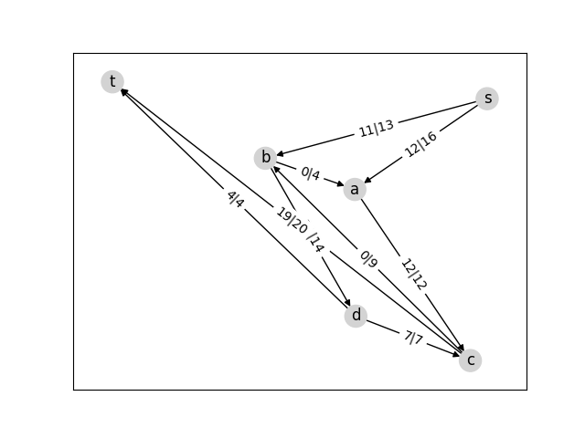

# BC² aka BILLOUARD CAMILLE & BEVILACQUA CEDRIC

## Contexte
On s’intéresse dans ce sujet à la modélisation d’un réseau de flot dont les capacités de chaque arc
peuvent varier dans le temps. Typiquement : un r´eseau routier avec des ralentissements, des incidents,
des élargissements de voies, des travaux ; mais aussi un réseau d’acheminement de marchandises dans un
entrepôt, un réseau de distribution de colis, etc.
Le prestataire en charge de g´erer ce réseau doit être capable de fournir à chaque instant le flot maximal.



## Fichiers inclus


## Installation

```bash
cd ~
git clone git@gitlab-etu.fil.univ-lille1.fr:billouard/graphes-dm-billouard-beilacqua.git
cd graphes-dm-billouard-beilacqua
```

## Présentation 

La classe Flownet a les fonctionnalités suivantes :
— créer un réseau à partir de sa description dans un fichier CSV
— créer un réseau à partir d’un graphe orienté NetworkX dans lequel les capacités sont des attributs capacity des arcs,
— obtenir le flot maximal (c’est un simple accesseur),
— mettre à jour la capacité d’un arc (1 seul arc à la fois pourra être modifié),
— afficher le réseau,
— enregistrer le réseau sous forme d’image,
— calculer le flot maximal.

## Tests
Ce placer à la racine du projet.

### Avec un notebook Jupyter

```bash
jupyter notebook
```
Et choisir le fichier FlowNet.ipynb.

### Avec l'interprète Python 

``` bash
python3 -i FlowNet.py 
```
A partir d'un fichier CSV.
```python
n = FlowNet('fig42.csv')
n.compute_max_flow()
n.show()
n.get_flow()
n.update("a","c",9)
n.get_flow()
n.update("a","c",15)
n.get_flow()
n.update("a","c",2)
n.get_flow()
n.show()
n.export("fig42.png")
exit()
``` 